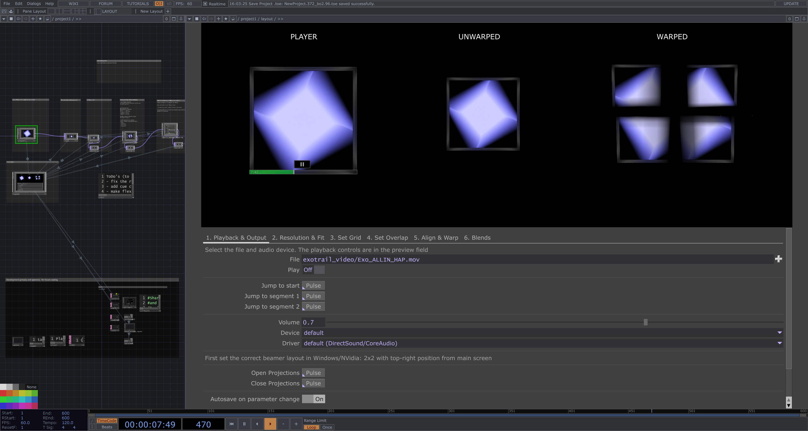

# beamer-blend
 a pipeline for multibeamer soft-edge blending and warping

This TouchDesigner-based tool was developed for **Urbanscreen** to support the immersive corporate event for Exotrail. The event featured projection content created by Urbanscreen, and the tool was designed to streamline the setup and calibration of a 2x2 projector grid for seamless projection blending. The goal was to provide a user-friendly interface for on-site specialists, ensuring efficient calibration and operation.

## Features

The tool is divided into several modular pages, each addressing a key stage of the projection setup:

1. **Playback & Output** 

   - File selection, playback, and timeline control.
   - Cue-based segment selection for precise playback.
   - Volume control, sound card selection, and autosave functionality.
   - Window opening for external displays.

2. **Resolution & Fit** 

   - Individual resolution adjustment for each projector.
   - Downscaling for soft-edge blending.

3. **Set Grid** 

   - Customizable test grid with adjustable rows, columns, and line thickness.
   - Used to align projection points for subsequent warping and blending.

4. **Set Overlap** 

   - Precise overlap adjustment for projector edges.
   - Preview functionality to confirm alignment.

5. **Align & Warp** 

   - External integration with **TD Multimapping Tool** for detailed warping and alignment.

6. **Blends** 

   - Fine-tuning of blend areas, luminance, and gamma for individual projectors.

## Additional Features
- **Preview Window**: A built-in viewer provides real-time feedback for all adjustments.
- **Scalability**: Designed for a 2x2 projector grid but can be adapted for different configurations.

## How It Works
1. Start by loading your media file via the **Playback & Output** page and select your desired playback segments.
2. Adjust individual projector resolutions and set a downscale factor for soft-edge blending on the **Resolution & Fit** page.
3. Use the **Set Grid** page to generate and align a test grid, ensuring accurate projection points.
4. Adjust overlaps between projectors on the **Set Overlap** page.
5. Fine-tune alignment and warping using the **Align & Warp** module.
6. Finalize blends, luminance, and gamma settings on the **Blends** page.

## Example in Action
Watch the tool in action during the Exotrail event:  
[Video on Facebook](https://www.facebook.com/watch/?v=434763119691771)

## Future Improvements
- Adapting the tool for more complex projector setups (e.g., larger grids or non-uniform arrangements).
- Extending the functionality for different media formats and projection requirements.
